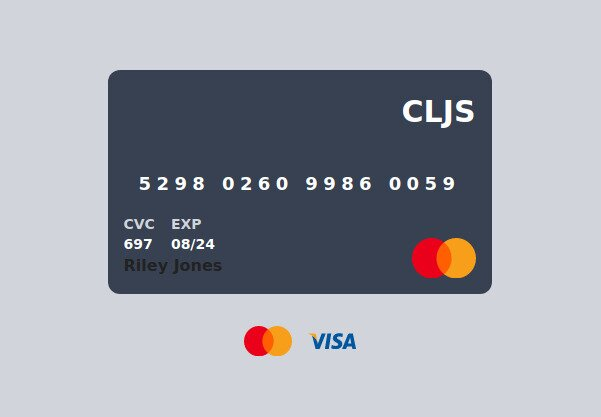

# Card

Generate mock Visa or MasterCard card information.

## Demo

Try the demo at https://ccard.netlify.app

## Features

- Visa or MasterCard card numbers
- Verified using the [Luhn algorithm](https://en.wikipedia.org/wiki/Luhn_algorithm)
- Random expiration date
- Random CVC (independent of the card number)

### Built With

- [ClojureScript](https://clojurescript.org/)
- [Reagent](https://github.com/reagent-project/reagent)
- [shadow-cljs](https://github.com/thheller/shadow-cljs)

## [Luhn Algorithm](https://en.wikipedia.org/wiki/Luhn_algorithm)

The formula verifies a number against its included check digit, which is usually appended to a partial account number to generate the full account number. This number must pass the following test:

- From the rightmost digit (excluding the check digit) and moving left, double
  the value of every second digit. The check digit is neither doubled nor
  included in this calculation; the first digit doubled is the digit located
  immediately left of the check digit. If the result of this doubling operation
  is greater than 9 (e.g., 8 × 2 = 16), then add the digits of the result
  (e.g., 16: 1 + 6 = 7, 18: 1 + 8 = 9) or, equivalently, subtract 9 from the
  result (e.g., 16: 16 − 9 = 7, 18: 18 − 9 = 9).
- Take the sum of all the digits (including the check digit).
- If the total modulo 10 is equal to 0 (if the total ends in zero) then the
  number is valid according to the Luhn formula; otherwise it is not valid.

## Disclaimer

The app is for data testing and verification purposes only. 
